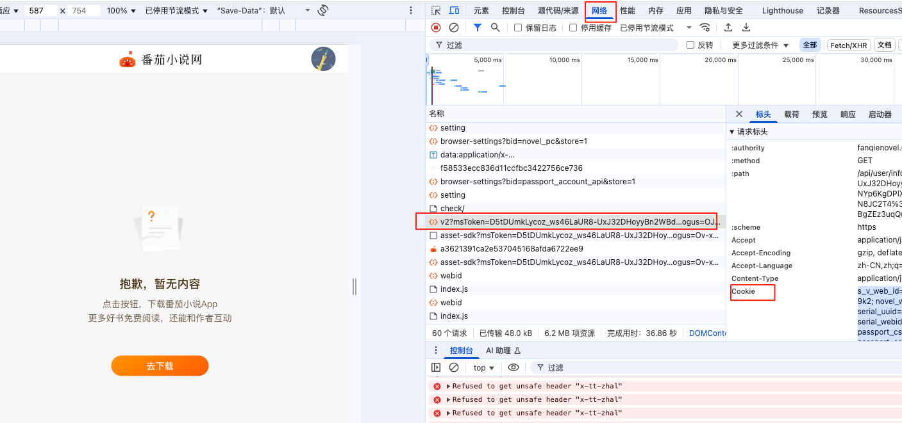

# EinkSync
墨水屏伴侣 快捷传输到汉王、起点墨水屏、微信读书。同步番茄七猫书架，一键下载上传番茄七猫书籍。
访问官网 [einksync.com](https://einksync.com) 了解更多详情。

# 多平台小说下载器

一个功能强大的多平台小说下载器，支持番茄小说、七猫小说等平台，提供TXT和EPUB格式下载，配备美观的网页界面、书库管理和多种上传功能。
上传功能基于汉王墨水屏的WiFi传书（内网）、口令传书（外网），起点墨水屏（输入端口、内网）一键上传到墨水屏设备。

## 🐳 Docker支持

本项目支持多架构Docker镜像（AMD64/ARM64），使用安全的源码编译版本：

```bash
# 快速启动（Docker会自动选择适合的架构）建议容器持久化
docker run -d -p 5000:5000 \
  -v $(pwd)/data:/app/data \
  -v $(pwd)/downloads:/app/downloads \
  -v $(pwd)/library:/app/library \
  xiaokun566/einksync:latest

例如： 我修改了本地访问端口，这样配置信息和书库书籍不会丢失
docker run -d -p 5008:5000 \
  -v /home/einkcom/data:/app/data \
  -v /home/einkcom/downloads:/app/downloads \
  -v /home/einkcom/library:/app/library \
  xiaokun566/einksync:latest
```


## 🎯 核心功能

- **📚 多平台支持**：番茄小说、七猫小说
- **🔍 智能搜索**：支持书名、作者、ID等多种搜索方式
- **📄 格式转换**：TXT/EPUB双格式支持，满足不同阅读需求
- **🗂️ 书库管理**：本地书库统一管理，支持格式转换和批量操作
- **📤 上传功能**：微信读书自动上传、本地服务器上传、口令传书上传、设备端本地文件上传
- **🔄 同步功能**：支持番茄和七猫书架记录同步，一键批量下载
- **⚙️ 智能配置**：优先使用网页配置Cookie，自动降级到环境变量配置
- **🛠️ 集成管理**：书库页面集成所有配置管理功能，统一操作界面

### 📖 多平台支持
- 🍅 **番茄小说**：支持搜索、预览、下载（基于API）
- 🐱 **七猫小说**：支持搜索、预览、下载（基于官方API + 备用爬虫 + 可配置并发）
- 📱 **微信读书**：支持自动上传到微信读书书架
- 🖥️ **本地服务器**：支持上传到自定义本地API服务器（汉王墨水屏-WiFi传书-WiFi传书）（起点-书架-更多-本地书导入）（内网使用）
- 🔑 **口令传书**：支持通过4位数字口令上传文件到阿里云OSS（汉王墨水屏-WiFi传书-口令传书）（外网使用）


### 🔍 智能搜索
- **番茄搜索**：基于关键词搜索，支持热门推荐
- **七猫搜索**：支持书名搜索和直接ID输入
- **搜索结果**：显示书名、作者、简介、封面等详细信息
- **批量操作**：支持搜索结果批量下载


### 🏛️ 书库管理
- **自动分类**：按平台来源分类（番茄红色、七猫金色标识）
- **避免重复**：已下载书籍自动保存，避免重复调用API
- **批量管理**：支持批量删除、格式转换
- **快速下载**：从书库直接下载，无需重新获取
- **🛠️ 集成配置管理**：统一的设置界面，包含以下功能：
  - **📱 本地上传API配置**：配置本地服务器上传地址
  - **🔑 微信读书手机API Token管理**：管理微信读书登录参数和Skey状态
  - **🍅 番茄API Key管理**：网页配置番茄小说API密钥，优先级高于环境变量
  - **⏰ 微信读书定时任务配置**：设置登录参数刷新间隔和检查间隔
  - **🔄 智能状态显示**：实时显示各项配置的有效性和状态
  
### 📤 上传功能
- **微信读书上传**：基于手机API的稳定上传，支持自动登录参数获取
- **自动书架同步**：上传完成后自动同步到微信读书书架
- **🌐局域网本地上传**：书库和本地文件支持在同一局域网内（设备和服务器或者web页面和设备）直接上传到设备，无需外网连接
- **本地服务器上传**：上传到自定义API服务器，支持服务器端和网页设备端两种模式
- **起点墨水屏上传**：支持服务器端上传模式，文件先上传到服务器再转发到起点设备，避免CORS限制
- **本地文件上传**：本地文件上传功能，支持上传到本地服务器、微信读书、起点墨水屏和口令传书四种方式
- **口令传书功能**：通过4位数字口令快速上传文件到阿里云OSS，支持TXT和EPUB格式


## 快速开始


### 配置环境变量（可选、所有功能都能网页配置）

```bash
# 番茄小说API密钥（必填）
FANQIE_API_KEY=你的番茄小说API密钥

# 番茄小说Token（可选，网页配置优先）
FANQIE_TOKEN=s_v_web_id=xxx

# 七猫小说Token（可选，网页配置优先）
QIMAO_TOKEN=eyJhbGciOiJIUzI1NiIsInR5cCI6IkpXVCJ9...

# 微信读书Cookie（可选，网页配置优先）
WEIXIRE_COOKIE=pgv_pvid=xxx

# 微信读书登录API配置
WEREAD_LOGIN_URL=https://i.weread.qq.com/login
WEREAD_VID=320472056
WEREAD_RANDOM=1136168490
WEREAD_DEVICE_ID=d0ccbeca8a258d988e38f621871c731b
WEREAD_DEVICE_NAME=甚番
WEREAD_SIGNATURE=159481f44ed86d3ca19d5cf9adf42b1d40eb7f3ae4c241d09db13fc1c6475bb9
WEREAD_REFRESH_TOKEN=onb3MjhSFzn6Pd-9kpOVe2NBDvOk@c9VYRTpJSyWu3Tzxa5evmAAA
WEREAD_WX_TOKEN=1
WEREAD_TIMESTAMP=1755266852
WEREAD_IN_BACKGROUND=0
WEREAD_DEVICE_TOKEN=70924a020c5a1f897783889bd5d25cca22463a822b43d99c1c3a8f13ca0e3101
WEREAD_USER_AGENT=WeRead/9.3.4 (iPhone; iOS 26.0; Scale/3.00)
WEREAD_VERSION=9.3.4.44

# 微信读书定时任务配置
WEREAD_REFRESH_INTERVAL_MINUTES=60  # 登录参数刷新间隔（分钟）
WEREAD_CHECK_INTERVAL_MINUTES=1  # 定时任务检查间隔（分钟）

# 本地服务器上传地址（可选）
BENDI_API=http://192.168.1.121:9310/

# 多线程查询数量（可选，默认10）
DUOXIANCHENGCHAXUN=10


> **?? 配置优先级说明**：
> 1. **网页配置优先**：程序优先使用网页界面中设置的Cookie/Token/API Key
> 2. **环境变量备用**：当网页未配置时，自动读取`.env`文件中的配置
> 3. **智能降级**：确保在不同使用场景下都能正常工作
> 4. **统一管理界面**：所有配置功能集中在书库页面的"管理"按钮中
> 5. **实时状态监控**：网页界面实时显示各项配置的有效性和状态

####  微信读书环境变量详解

| 环境变量 | 说明 | 默认值 | 是否必填 |
|---------|------|--------|----------|
| `WEREAD_LOGIN_URL` | 微信读书登录API地址 | `https://i.weread.qq.com/login` | 否 |
| `WEREAD_VID` | 用户视频ID | `320472056` | 是 |
| `WEREAD_DEVICE_ID` | 设备唯一标识 | `d0ccbeca8a258d988e38f621871c731b` | 是 |
| `WEREAD_DEVICE_NAME` | 设备名称 | `甚番` | 否 |
| `WEREAD_SIGNATURE` | 请求签名 | 见配置文件 | 是 |
| `WEREAD_REFRESH_TOKEN` | 刷新令牌 | 见配置文件 | 是 |
| `WEREAD_DEVICE_TOKEN` | 设备令牌 | 见配置文件 | 是 |
| `WEREAD_USER_AGENT` | 用户代理字符串 | `WeRead/9.3.4 (iPhone; iOS 26.0; Scale/3.00)` | 否 |
| `WEREAD_VERSION` | 应用版本号 | `9.3.4.44` | 否 |
| `WEREAD_REFRESH_INTERVAL_MINUTES` | 登录参数刷新间隔（分钟） | `60` | 否 |
| `WEREAD_CHECK_INTERVAL_MINUTES` | 定时任务检查间隔（分钟） | `1` | 否 |
```
## Cookie 获取
### 番茄小说
1.在番茄官网登录后，打开书架-键盘输入F12→选择Network(网络)，刷新书架页面请求，复制请求头里的 Cookie 到下方：

### 七猫小说
1.登录 七猫小说网站  
2.访问书架页面  
3.按F12打开开发者工具  
4.切换到Network面板  
5.找到请求，复制Authorization头中的token  

### 微信读书 （配置页在书库-管理）
微信读书比较复杂、手机微信读书App抓包的 login 请求体。打开抓包软件打开微信读书App-在书架页面等待10-30分钟(大概20分钟左右发送一次登陆请求包)-等待微信读书发送登陆请求-搜索login请求-复制请求体-粘贴在上方即可
### 亚马逊cookie 获取
获取Amazon cookies步骤： 
打开浏览器，访问 [Amazon Send-to-Kindle](https://www.amazon.com/gp/sendtokindle)  
登录你的Amazon账户  
按F12打开开发者工具，切换到Network标签  
刷新页面，找到第一个请求sendtokindle  
在请求头中找到"Cookie"字段，复制完整的cookie字符串  
直接粘贴到上方文本框（支持标准HTTP Cookie格式）  
支持的格式：  
• 标准HTTP Cookie格式：session-id=xxx; ubid-main=xxx; ...  
• JSON格式：[{"name":"session-id","value":"xxx"},...]  


##汉王墨水屏高级配置  
 功能说明  
汉王墨水屏不需要和服务器在同一个局域网也能使用方法。只要网页打开设备和汉王墨水屏在同一个局域网即可实现。  
⚠️ 重要注意事项：  
网络要求：网页和设备必须在同一局域网内  
协议匹配：如果网页使用HTTPS，设备地址也必须使用HTTPS  
设备配置：需要修改汉王墨水屏接口配置以支持网页直连  
安全考虑：请确保设备网络安全，避免未授权访问  
 如需使用请开启进阶功能，请详细阅读注意事项！  
